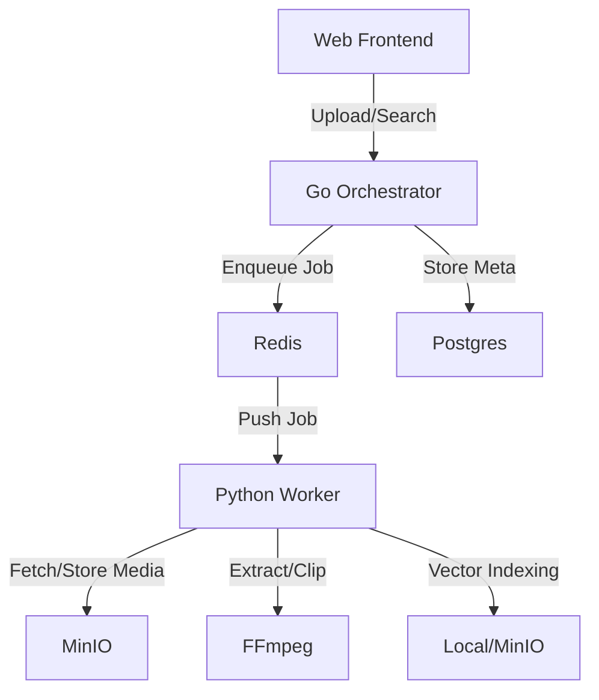

# SceneExtractor 🎬

A distributed video search engine that lets you find the exact moment you're looking for.


## 💡 The Idea

Imagine having a "Google Search" for your personal video collection. Instead of scrubbing through hours of footage to find that one specific quote or scene, **SceneExtractor** lets you type a natural language query (e.g., *"I need a million dollars"*) and instantly retrieves the exact video clip frame where that dialogue occurs.

It treats video dialogue as searchable data, indexing content semantically so you can find scenes even if you don't remember the exact words.

## 🚀 Key Features

-   **Semantic Search:** Find scenes by meaning, not just keyword matching.
-   **Frame-Perfect Retrieval:** Returns the exact video clip corresponding to the dialogue.
-   **Distributed Architecture:** Built for scalability with separate microservices for orchestration and processing.
-   **Modern UI:** Clean, responsive web interface for uploading and searching.

## 🛠️ Technology Stack

SceneExtractor is built as a set of distributed microservices:

### **Backend (The Brain)**
-   **Go (Golang):** High-performance Orchestrator service using the **Gin** framework.
-   **Redis:** Manages job queues (`scene_jobs`, `queue:transcription`).
-   **PostgreSQL:** Persists job metadata and status.

### **Worker (The Muscle)**
-   **Python:** Handles heavy lifting for media processing and AI.
-   **FFmpeg:** Extracts subtitles and generates video clips.
-   **Sentence-Transformers:** Generates vector embeddings for dialogue.
-   **NumPy:** Performs efficient cosine similarity vector search.

### **Storage**
-   **MinIO:** S3-compatible object storage for videos and index files.

### **Frontend**
-   **Next.js (React):** A fast, modern web interface.
-   **TailwindCSS:** For beautiful, responsive styling.

## 🏗️ Architecture



## ⚡ Quick Start

The entire system is containerized. You can spin it up with a single command.

### Prerequisites
-   Docker & Docker Compose

### Run Local
1.  **Clone the repo**
    ```bash
    git clone https://github.com/yourusername/scenextractor.git
    cd scenextractor
    ```

2.  **Start Services**
    ```bash
    cd infra
    docker-compose up -d --build
    ```

3.  **Access the App**
    Open [http://localhost:3000](http://localhost:3000) to upload videos and start searching!

## 📝 API Usage (Dev)

You can also interact directly with the API:

```bash
# Upload a video
curl -X POST http://localhost:8080/upload \
  -H "Content-Length: $(stat -c%s video.mkv)" \
  --data-binary @video.mkv

# Search for a clip
curl -X POST http://localhost:8080/query_clip \
  -H "Content-Type: application/json" \
  -d '{"query": "hello world", "clip_duration": 15}'
```
